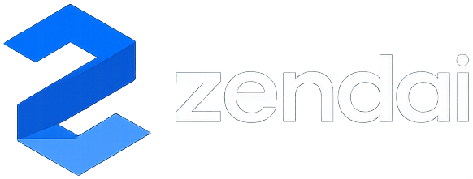

<div align="center">



AI-powered 3D generation from a single prompt.

[](https://github.com/sihaowu1/zendai)
[](https://github.com/sihaowu1/zendai/network/members)

</div>

---

**Don't settle for black-box mesh generators you can't edit.**

Zendai turns natural language prompts (or reference photos) into fully editable Three.js code. Component-based, tunable, and running live in the browser. Every result is real code you can tweak, remix, animate, and export.

[View the Devpost](https://devpost.com)

## Key Features

### Model Generation

Describe what you want and get a live 3D scene back instantly.

- **Prompt to 3D**: Natural language descriptions become component-based Three.js scenes with named parts.
- **Image to 3D**: Upload a reference photo and the img2threejs pipeline decomposes it into primitives, extracts PBR materials, and reconstructs it as editable code.
- **Tunable Sliders**: Every model exposes per-part size, color, and material parameters as real-time sliders.
- **Code Editor**: Full CodeMirror editor with syntax highlighting. Edit the generated code directly and see changes live.
- **Iterative Refinement**: Follow-up prompts modify the existing model without rebuilding from scratch.

### Video & Animation

Animate models and compose them into exportable videos.

- **Natural Language Animation**: Describe the motion you want and the AI adds one-shot timeline animation.
- **Timeline Composer**: Drag and arrange animated clips on a visual timeline.
- **MP4 Export**: Server-side rendering via Remotion produces production-quality video.

### Export & Collaboration

Ship your work anywhere.

- **GitHub Integration**: Push models to a linked repo, pull remote state, version your scenes.
- **Geometry Export**: Download as GLB, OBJ, or STL for use in any 3D pipeline.
- **Code Export**: Standalone JS/TS bundles ready to drop into any Three.js project.

## Tech Stack

| Layer | Technologies |
|-------|-------------|
| Frontend framework | React 18, TypeScript, Vite |
| Styling and UI | Tailwind CSS v4, Lucide icons, Phosphor icons |
| 3D and visualization | Three.js, WebGL, OrbitControls |
| Code editor | CodeMirror 6 (JavaScript + Python, One Dark theme) |
| Client state | React hooks, localStorage persistence |
| Auth | Auth0 (GitHub OAuth), optional |
| Backend framework | Express, Node.js, TypeScript (tsx) |
| AI model | Claude Sonnet 4.5 via OpenRouter (Anthropic SDK) |
| AI skills | Markdown skill files loaded as system prompts |
| Video rendering | Remotion (server-side MP4 export) |
| Database | MongoDB Atlas (optional, marketplace only) |
| GitHub integration | Octokit (create repos, commit, pull) |
| Geometry export | Three.js exporters (GLB, OBJ, STL) |
| Monorepo | npm workspaces (shared, server, web, remotion) |

## How It Works

### Text to 3D workflow

```
Prompt
  -> Skill selection (threejs-modelling)
  -> Claude generates Three.js scene module
  -> Validator enforces contract
  -> Hot-loaded in WebGL viewport
  -> Live 60fps rendering with tunable sliders
```

### Image to 3D workflow

```
Reference photo
  -> img2threejs skill (structured decomposition)
  -> Component inventory + material extraction
  -> Proportion mapping + primitive assembly
  -> Validated Three.js scene module
  -> Live editable model in viewport
```

## Quick Start

```bash
# 1. Install dependencies
npm install

# 2. Configure environment
cp .env.example .env
# add your OPENROUTER_API_KEY (minimum for AI features; app works without it via offline fallback)

# 3. Start dev server (backend + frontend)
npm run dev
```

- Frontend: http://localhost:5173
- Backend: http://localhost:5174

## Environment Variables

| Variable | Purpose | Required |
|----------|---------|----------|
| `OPENROUTER_API_KEY` | Claude API access for AI generation | No (offline fallback) |
| `VITE_AUTH0_DOMAIN` | Auth0 tenant domain | No |
| `VITE_AUTH0_CLIENT_ID` | Auth0 SPA client ID | No |
| `VITE_AUTH0_AUDIENCE` | Auth0 API audience | No |
| `AUTH0_MGMT_CLIENT_ID` | Auth0 M2M client (GitHub push) | No |
| `AUTH0_MGMT_CLIENT_SECRET` | Auth0 M2M secret (GitHub push) | No |
| `MONGODB_URI` | MongoDB Atlas (marketplace) | No |
| `ANTHROPIC_MODEL` | Model override (default: `anthropic/claude-sonnet-4.5`) | No |

## Repo Layout

```
.
├── config/              Default runtime configuration
├── remotion/            Remotion composition for MP4 export
├── server/              Express backend
│   └── src/
│       ├── agents/      AI agents (scene, animation, critique, intent, orchestrator)
│       ├── ai/          Client setup, skill loader, code extraction
│       ├── auth/        Auth0 JWT middleware
│       ├── routes/      API routes (generate, animate, export, github, marketplace)
│       └── utils/       Logging, tracing
├── shared/              Types, validation, templates, tunables parser
├── skills/              AI skill definitions (system prompts)
│   ├── img2threejs/     Image-to-3D reconstruction
│   ├── threejs-modelling/   Text-to-3D modelling
│   ├── threejs-animation/   Animation generation
│   └── procedural-patterns/ Geometry and material recipes
├── web/                 Vite + React frontend
│   └── src/
│       ├── components/  UI (ChatPanel, ModelsList, screens, timeline)
│       ├── editor/      CodeMirror scene editor
│       ├── landing/     Marketing landing page
│       ├── state/       useSceneProject (all editor state)
│       └── viewport/    Three.js WebGL runtime and exporters
└── .env.example         Environment template
```

## Team

Derek Lau, Sihao Wu, Ethan Yang, Ian Yeh

## License

MIT. Built for Hack the 6ix 2026.
